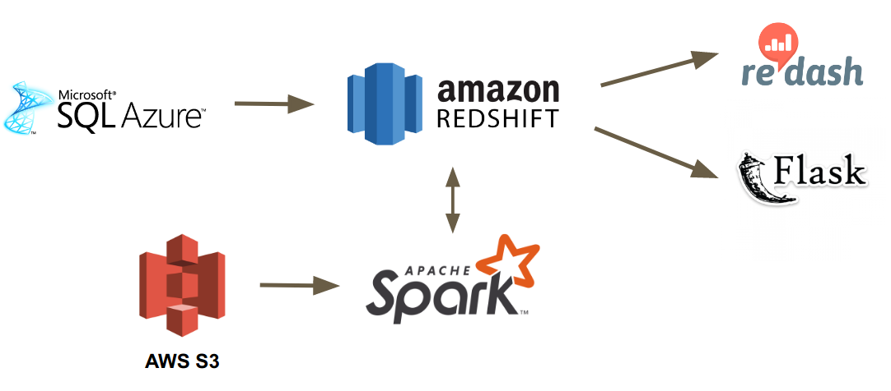

# Thalamus-Analytics

Thalamus Analytics is my consulting project in Insight Data Science for ThalamusGME.

***Note: This public repository only contains a few source code samples. These code snippets highlight the use of pyspark dataframe. You can find them in [src/etl](src/etl) and [src/cnx](src/cnx) directories***

* [1. Data Pipeline](README.md#Data-Pipeline)
* [2. System Setup and Configuration](README.md#System-Setup-and-Configuration)


# Data Pipeline



### Ingestion and Databases

The data pipeline starts with Azure SQL server database, where ThalamusGME's operational data resides. A light weight ODBC/JDBC connector (single node & serial) in this project transfer data from Azure SQL server to Amazon Redshift, our data warehouse. In Redshift, there are three schemas TASTG, TADW, and TARPT: 

**TASTG**: Staging tables are created in this schema. When tables are migrated from Azure SQL to Redshift, mirroring tables are created in TASTG and all data transferred. Some nvarhcar and text columns are truncated to size 1000 to moderately reduced data size. Binary columns are not supported in Redshift, thus not migrated. There are two types of data load on staging tables, initial load and incremental load. In this project, data is loaded as initial load, which means full table copy. Under current condition(06/19/2017) with relatively small data size, initial load from all tables in Azure SQL DBO schema takes a few minutes. After initial loads, it's recommended to only load incremental data, to keep the workload of our ODBC/JDBC connector relatively small. When the data volume reached a certain height, full table copy from Azure SQL to Redshift using our JDBC connector may take too much time to be viable.

**TADW**: Data warehouse tables are included int his schema. Tables in TADW are slightly denormalized to reduce he amount of joins. Typically, program_id and calendar_season_id are added to a few tables. In Redshift, primary key and foreign key are not enforced, but only for the purpose of schema design.

**TARPT**: Report tables are create in this schema. Complex logic that generates report tables is implemented in Spark (PySpark and DataFrame).

### Spark (ETL)
Spark is used to handle the ETL process on Redshift data. Spark scripts are written with [PySpark DataFrame](http://spark.apache.org/docs/2.1.0/api/python/pyspark.sql.html) which represents Spark RDD operation in a SQL-like fashion.  

### Data Visualization and RestAPI
Data Visualization is achieved by [redash.io](https://redash.io/) and [Amazon QuickSight](README.md###Amazon-QuickSight). 
Restful API is generated by [flask-restful](README.md###Flask)


# System Setup and Configuration 

### Python 
Install pyhton 2.7 on your machine. https://www.python.org/downloads/

### AWS Stack
Here's a list of services needed for infrastructure: 

**Redshift**: [Distributed columnar database](http://docs.aws.amazon.com/redshift/latest/gsg/getting-started.html). 

**EC2**: cloud servers used to build Spark cluster, using Pegasus (see [Pegasus & Spark](README.md###Pegasus-&-Spark) )

**S3**: Needed by [Spark-Redshift](README.md###Spark-Redshift) to store temporary data files. 
  
**VPC**: Network Security

**IAM**: Role, group, and user access control


### Azure SQL ODBC
Following the instructions on [Azure web site](https://docs.microsoft.com/en-us/azure/sql-database/sql-database-connect-query-python)

Linux / Unix Users: 

```bash
sudo su
curl https://packages.microsoft.com/keys/microsoft.asc | apt-key add -
curl https://packages.microsoft.com/config/ubuntu/16.04/prod.list > /etc/apt/sources.list.d/mssql.list
exit
sudo apt-get update
sudo apt-get install msodbcsql mssql-tools unixodbc-dev
sudo pip install pyodbc==3.1.1
```
Windows Users: 
```bash
pip install pyodbc==3.1.1
```
You can check [src/cnx/odbc_azure_cnx.py](src/cnx/odbc_azure_cnx.py) for implementation details

### Redshift, psycopg2 & JDBC
Redshift is build upon PostgreSQL, so we can use psycopg2 to connect. 
```bash
pip install psycopg2
```
You can check [src/cnx/jdbc_redshift_cnx.py](src/cnx/jdbc_redshift_cnx.py) for implementation details.

### Pegasus & Spark
We use [Pegasus](https://github.com/InsightDataScience/pegasus)(An Insight open source project) to set up the Spark cluster. You will need install Pegasus on Linux machine. 
```bash
$ git clone https://github.com/InsightDataScience/pegasus.git
$ pip install awscli
```
### Spark-Redshift(DataBricks)
[Spark-Redshift connector](https://github.com/databricks/spark-redshift), an open source product by DataBricks, is used to connect Spark cluster and Redshift database. The jar package RedshiftJDBC42-1.2.1.1001.jar has already been included in [jars](jars/RedshiftJDBC42-1.2.1.1001.jar), so there's no configuration needed

### Flask
We use [Flask to generate Restful APIs.](https://flask-restful.readthedocs.io/)
```bash
pip install flask-restful
```

